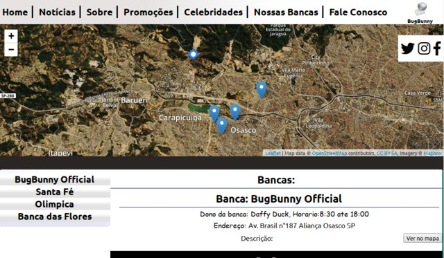

# Projeto BugBunny




Esse projeto se baseia na criação e desenvolvimento de um site para uma rede de bancas de jornal. Usando **PHP**, **JQuery**, **Vuejs** e **MariaDB**.

## How Run:
```shell
$ docker compose up
```

## Bibliotecas

* [PHP](https://www.php.net/manual/pt_BR/intro-whatis.php) - Linguagem de preogramação para desenvolvimento web e muitas outras coisas!
* [Chart.js](https://www.chartjs.org/) - Biblioteca de js para criação de gráficos 
* [JQuery](https://jquery.com/) - Biblioteca de js que serve como Utilitários(Ajax e etc) 
* [Leaflet.js](https://leafletjs.com/) - Biblioteca de js para trabalhar com mapas
* [Vue.js](https://vuejs.org/) - Framework para criar e trabalhar com web-compoment e criação de SPA(aplicações de uma pagina):cms/views/tblBancas.vue.php
